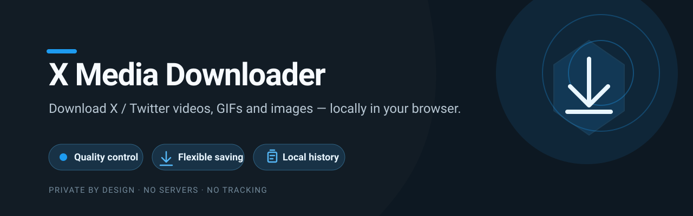
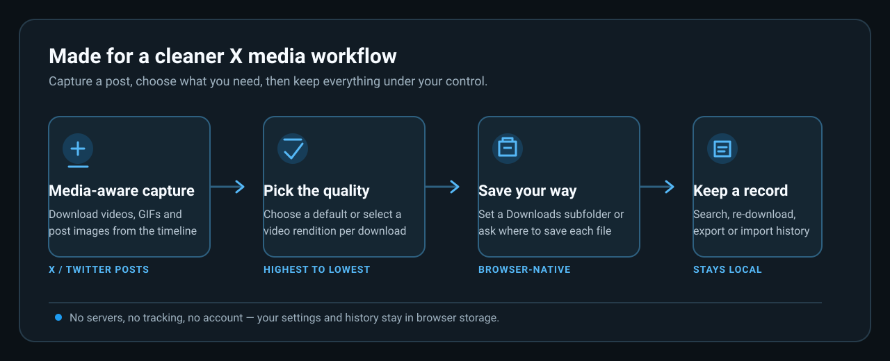
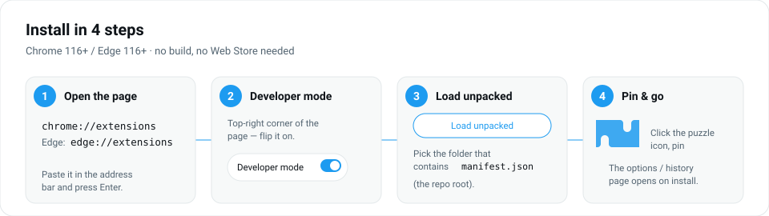

[](https://developer.chrome.com/docs/extensions/develop/migrate/what-is-mv3) [](LICENSE) [](https://www.google.com/chrome/) [](https://www.microsoft.com/edge)

# X Media Downloader

A rewritten, open‑source Chrome/Edge extension (Manifest V3) for downloading
videos, GIFs **and images** from **X / Twitter**.

It was built to fix three things that the older “x‑downloader” style extensions
get wrong:

| Problem in the old extension | What this one does |
| --- | --- |
| **No download history** | Every download is recorded on the options page — thumbnail, account, quality, size, date, state — with search, re‑download, “show file”, export/import JSON. |
| **No control over where files go** | A configurable **subfolder** inside your Downloads folder, plus an optional **“Ask where to save every time”** mode that opens Chrome’s Save‑As dialog so you can pick any location. |
| **Always downloads the wrong quality** | A **default quality** setting (Highest / 1080p / 720p / 480p / 360p / Lowest, “closest below” your target) and a per‑download quality picker in the popup and the timeline button. |

No servers, no tracking, no account. Everything runs locally in your browser.

**Languages:** English, 简体中文, 日本語, Español, Português (Brasil), 한국어, Deutsch —
the extension name/description follow your Chrome UI language automatically
(`_locales/`); everything else in the interface is in English.

---

## Features



---

## Install (unpacked)

There is no build step and it is not on the Web Store yet — you load the folder
directly. Takes about a minute.



1. **Get the code.** Clone it, or download the ZIP from the green **Code**
   button above and unzip it somewhere permanent (don't delete the folder
   afterwards — Chrome loads the extension from it every launch).

   ```bash
   git clone https://github.com/wangsen2020/x-media-downloader.git
   ```

2. **Open the extensions page.** Type `chrome://extensions` in the address bar
   and press Enter. On Edge it's `edge://extensions`.

3. **Turn on Developer mode.** The toggle is in the top‑right corner of that
   page (在中文界面里是右上角的 **“开发者模式”**). Three buttons appear.

4. **Load unpacked.** Click **Load unpacked** (**“加载未打包的扩展程序”**) and
   pick the repository folder — the one that directly contains `manifest.json`.

5. **Done.** The history / settings page opens automatically on first install.
   Open the puzzle‑piece menu in the toolbar and pin **X Media Downloader** so
   its icon is always visible.

> Chrome 116+ / Edge 116+ (needs `chrome.storage.session` and MV3
> service‑worker modules).

### Updating

```bash
git pull
```

Then go back to `chrome://extensions` and click the **↻ reload** icon on the
X Media Downloader card.

## Usage

- **From the timeline:** a **⬇** download icon appears in the action bar of
  every post that has a video **or image(s)**. Click it to grab the video at
  your default quality, or all images at original resolution. **Alt‑click**
  (or disable *“downloads immediately”* in settings) to open a menu — video
  renditions, or image sizes (Original / Large / Medium).
- **From the popup:** open a tweet that has a video, click the toolbar icon,
  choose a quality, hit **Download video**. The popup also shows your last few
  downloads.
- **History & settings:** right‑click the toolbar icon → *Options*, or use the
  gear in the popup.

## Settings

| Setting | Notes |
| --- | --- |
| **Default video quality** | `Highest`, a target height (`1080/720/480/360`, resolved as the best rendition that does not exceed it), or `Lowest`. |
| **Filename template** | Default `{user}_{text}_{datetime}_{id}` — author + first words of the tweet + the tweet's post time + its id, so names are descriptive **and** collision-proof. Tokens: `{user} {text} {datetime} {date} {time} {id} {quality} {height} {bitrate} {index}`. `.mp4` is appended automatically; `/` nests folders. |
| **Subfolder** | A relative folder inside your browser’s Downloads directory. Blank = straight into Downloads. |
| **Ask where to save every time** | Opens the native Save‑As dialog for every download. Overrides the subfolder. |
| **Show a Download button in the timeline** | Toggle the injected button. |
| **Timeline button downloads immediately** | Off = the button opens a quality menu instead. |
| **Keep at most** | History is trimmed to this many entries (oldest dropped). |

### Why can’t I just pick an absolute path?

Browser extensions are sandboxed: the `chrome.downloads` API can only write
**inside the browser’s Downloads folder** (a relative subfolder is allowed) or
prompt you with the Save‑As dialog. There is no API to set an arbitrary
`D:\Videos\...` target silently. This extension gives you both supported
options; pick “Ask where to save every time” if you need per‑file control, or
change Chrome’s Downloads location in `chrome://settings/downloads`.

## How it works

```
injected.js   (page context)  – hooks fetch() / XHR, reads X's own GraphQL
                                responses, extracts video_info.variants
      │  window.postMessage
      ▼
content.js    (content script) – caches media per tweet, injects the timeline
                                button, relays to the worker
      │  chrome.runtime.sendMessage
      ▼
background.js  (service worker) – resolves media (live capture → session cache →
                                cdn.syndication.twimg.com fallback), picks the
                                variant for the requested quality, builds the
                                filename, calls chrome.downloads.download,
                                tracks progress into history
      │
      ▼
options / popup (chrome.storage.local) – settings + history UI
```

The syndication fallback (`cdn.syndication.twimg.com/tweet-result`) is the same
public endpoint embedded tweets use, so single‑tweet pages work even if the API
response was never seen. Only progressive **MP4** renditions are offered
(HLS/`m3u8` playlists can’t be saved as a single file by the downloads API).

**Images** are read straight from the tweet’s `` elements — both attached
photos (`pbs.twimg.com/media/…`) and link‑preview card thumbnails
(`…/card_img/…`). The `name=` size parameter is rewritten to `orig` so you get
full resolution, and the real extension (`jpg` / `png`) is kept. Multi‑image
posts download every picture, numbered `_1`…`_4`.

## Privacy

- No analytics, no external calls except to X / Twitter’s own domains and the
  public Twitter syndication CDN to resolve a video.
- History and settings live in `chrome.storage.local` on your machine and never
  leave it. Export is a manual button.
- Permissions: `downloads` (save files), `storage` (settings/history),
  host access to `x.com` / `twitter.com` and `cdn.syndication.twimg.com`.

## Development

Plain JS, no build step. Edit files, then hit **Reload** on the extensions page.

```
src/
  injected.js      page hook
  content.js       content script + timeline UI
  content.css
  background.js     service worker
  lib/media.js      variant parsing, quality pick, filename builder, syndication
  lib/store.js      settings + history persistence
  popup/            toolbar popup
  options/          history + settings page
icons/             generated PNGs (see tools/genicons.mjs)
```

### Package a zip

```bash
npm run zip
```

Produces `x-media-downloader-<version>.zip` suitable for uploading to the
Chrome Web Store / Edge Add‑ons dashboard.

## Legal

For personal use. Respect the rights of content owners and
[X’s Terms of Service](https://twitter.com/en/tos). Don’t redistribute
downloaded media without permission. This project is not affiliated with X Corp.

## License

MIT — see [LICENSE](LICENSE).
